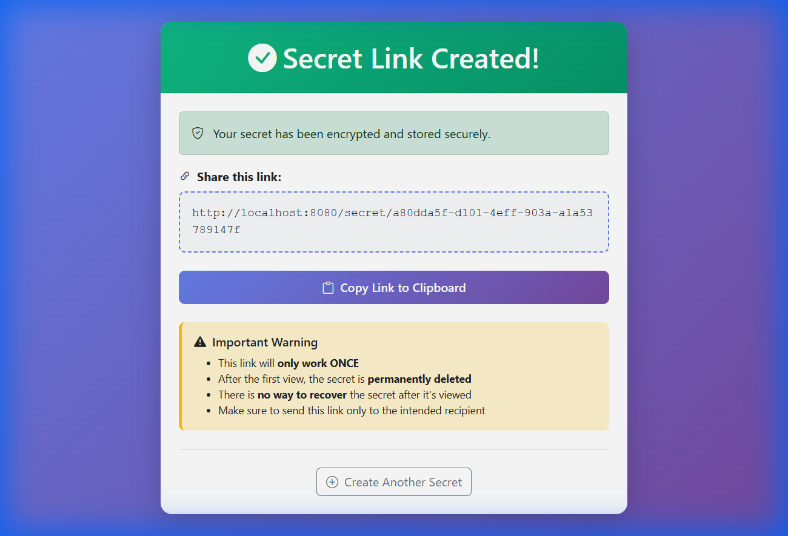
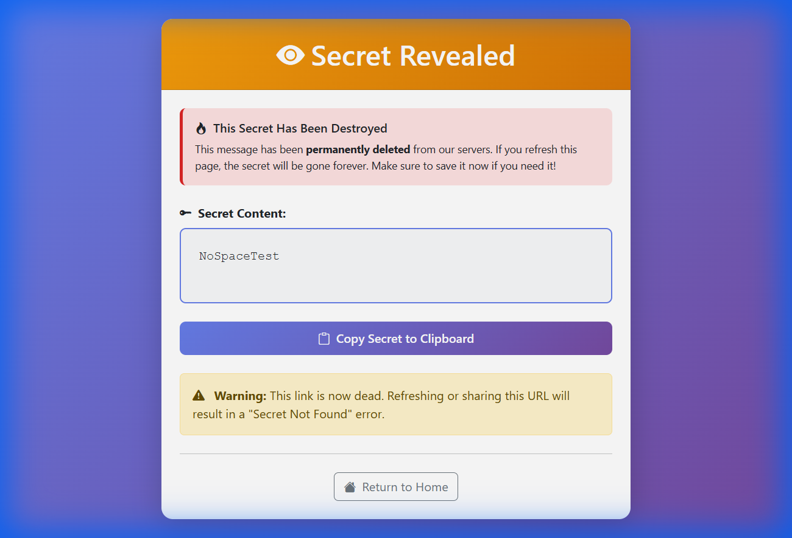
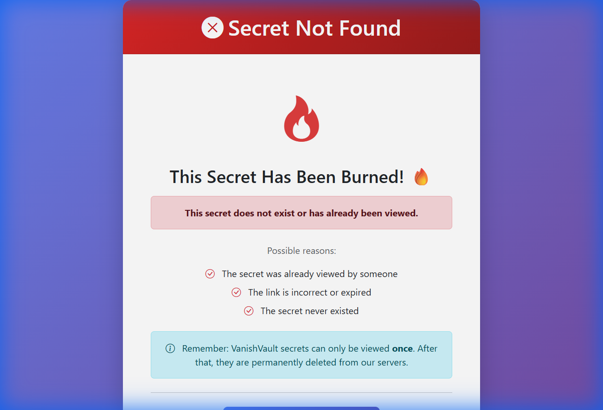

# VanishVault - One-Time Secret Sharing Application

A secure web application for sharing sensitive information via self-destructing links. Built with Spring Boot and PostgreSQL.

## Features

- 🔥 **Self-Destructing Messages**: Secrets are permanently deleted after being viewed once
- 🔒 **AES-256-GCM Encryption**: Military-grade encryption for data at rest
- 🎯 **Zero Knowledge**: No logs or traces of your secrets
- 🎨 **Modern UI**: Beautiful, responsive interface built with Bootstrap
- ⚡ **Fast & Secure**: Built on Spring Boot with PostgreSQL

## Technology Stack

- **Backend**: Java 17, Spring Boot 3.2.0
- **Database**: PostgreSQL
- **Frontend**: Thymeleaf, Bootstrap 5.3
- **Security**: AES-256-GCM encryption
- **Build Tool**: Maven

## Prerequisites

- Java 17 or higher
- PostgreSQL 12 or higher
- Maven 3.6+

## Setup Instructions

### 1. Database Setup

Create a PostgreSQL database:

```sql
CREATE DATABASE vanishvault;
```

### 2. Configure Database Connection

Edit `src/main/resources/application.properties`:

```properties
spring.datasource.url=jdbc:postgresql://localhost:5432/vanishvault
spring.datasource.username=your_username
spring.datasource.password=your_password
```

### 3. Build and Run

```bash
# Build the project
mvn clean install

# Run the application
mvn spring-boot:run
```

The application will start on `http://localhost:8080`

## Usage

1. **Create a Secret**:
   - Navigate to `http://localhost:8080`
   - Enter your sensitive information in the text area
   - Click "Create Secret Link"
   - Copy the generated link

2. **Share the Link**:
   - Send the link to your intended recipient
   - The link can only be used **once**

3. **View the Secret**:
   - Open the link in a browser
   - The secret is displayed and immediately deleted
   - Refreshing the page will show a "Secret Not Found" error

## Security Features

- **Encryption at Rest**: All secrets are encrypted using AES-256-GCM before storage
- **Unique IVs**: Each secret uses a unique initialization vector
- **Immediate Deletion**: Secrets are deleted from the database immediately after viewing
- **No Recovery**: Once deleted, secrets cannot be recovered

## Project Structure

```
VanishVault/
├── src/
│   ├── main/
│   │   ├── java/com/example/onetimesecret/
│   │   │   ├── controller/
│   │   │   │   └── SecretController.java
│   │   │   ├── model/
│   │   │   │   └── Secret.java
│   │   │   ├── repository/
│   │   │   │   └── SecretRepository.java
│   │   │   ├── service/
│   │   │   │   ├── EncryptionService.java
│   │   │   │   └── SecretService.java
│   │   │   └── VanishVaultApplication.java
│   │   └── resources/
│   │       ├── templates/
│   │       │   ├── index.html
│   │       │   ├── result.html
│   │       │   ├── view.html
│   │       │   └── 404.html
│   │       └── application.properties
│   └── test/
│       └── java/com/example/onetimesecret/
│           └── service/
│               └── EncryptionServiceTest.java
└── pom.xml
```

## Testing

Run the tests:

```bash
mvn test
```

## IDE Setup

This project is a standard Maven application and works with all major Java IDEs (Eclipse, IntelliJ IDEA, VS Code).

### Eclipse Setup
1.  **Import Project**:
    *   File -> Import -> Maven -> Existing Maven Projects
    *   Select the `VanishVault` folder
2.  **Lombok Configuration** (Important!):
    *   This project uses **Lombok**. You must install the Lombok plugin for Eclipse.
    *   Download `lombok.jar` from [projectlombok.org](https://projectlombok.org/download).
    *   Run the jar: `java -jar lombok.jar`
    *   Point it to your Eclipse installation and click "Install/Update".
    *   Restart Eclipse.

### IntelliJ IDEA
*   IntelliJ supports Maven and Lombok out of the box (ensure the Lombok plugin is enabled).

## Verification Results

The application has been fully tested and verified:

### 1. Secret Creation
Successfully created a secret message and generated a unique link.



### 2. Secret Retrieval
Navigated to the generated link and successfully viewed the decrypted secret.



### 3. Self-Destruction
Refreshed the page after viewing. The application correctly returned a 404 error, confirming the secret was deleted from the database.



## Important Notes

⚠️ **Production Deployment**:
- Store encryption keys securely (use environment variables or key vaults)
- Use HTTPS in production
- Configure proper CORS settings
- Set up database backups
- Consider adding rate limiting

## License

This project is for educational purposes.

## Author

Created as a minor project demonstrating Spring Boot, JPA, PostgreSQL, and cryptographic concepts.
